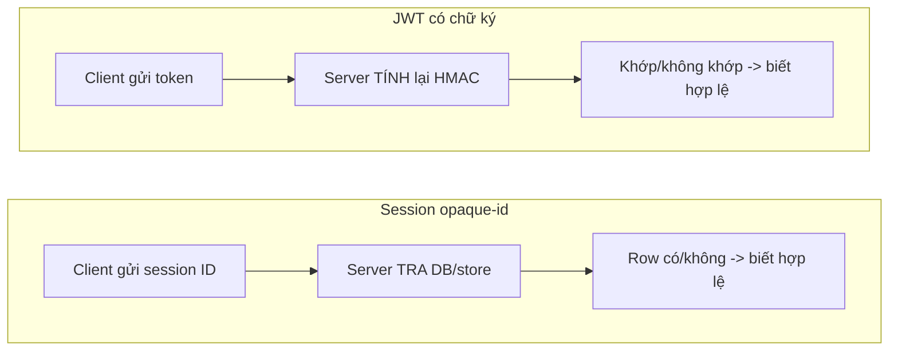
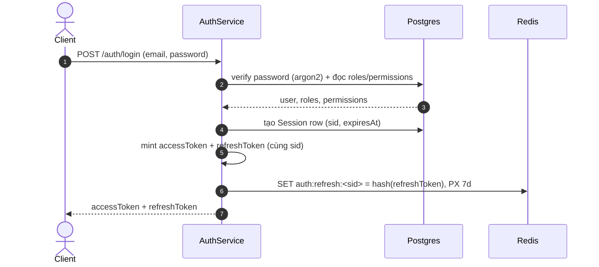
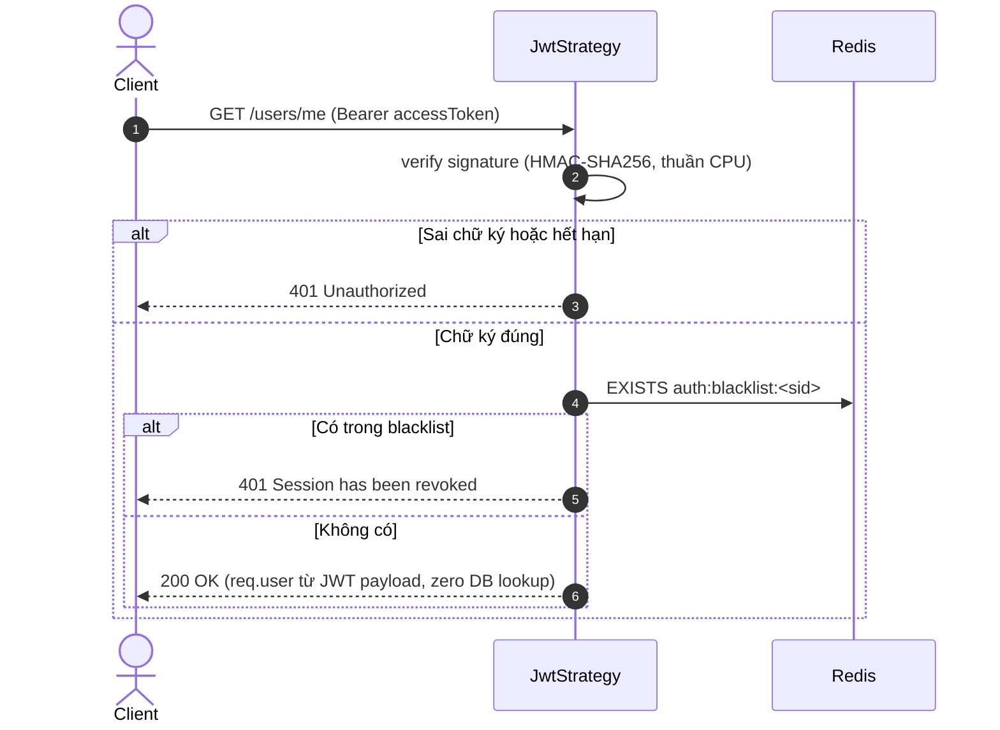
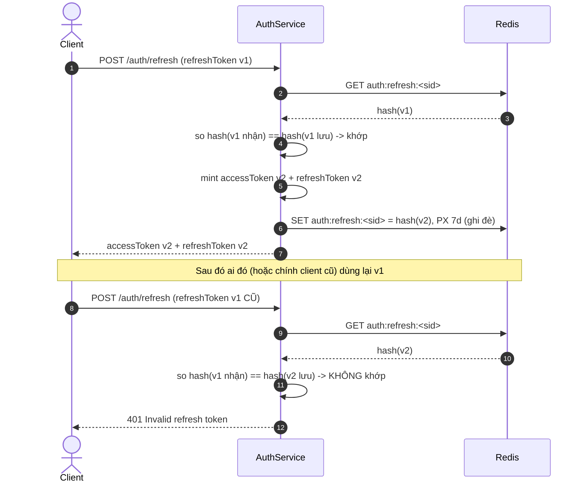
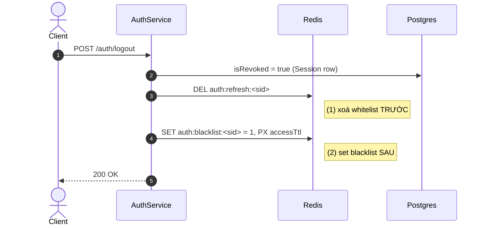

# Auth Flow Giải Thích — JWT, Redis, RBAC

Tài liệu chia sẻ để hiểu **vì sao** hệ thống auth này được thiết kế như vậy, không chỉ **là gì**. Đối tượng đọc: kỹ sư trong team. Bài toán gốc xem `PROBLEM_STATEMENT.md`; đây là phần "cơ chế hoạt động thật" — đi theo đúng thứ tự 1 request thật chạy qua hệ thống, và mỗi khái niệm (Whitelist, Blacklist, RBAC, Rotation...) có mục riêng để nhảy thẳng tới khi cần tra cứu.

## Mục lục

1. [Vấn đề gốc: JWT không tự "hủy" được](#1-vấn-đề-gốc-jwt-không-tự-hủy-được)
2. [Kiến trúc token](#2-kiến-trúc-token)
3. [Login — mint token, tạo Whitelist](#3-login--mint-token-tạo-whitelist)
4. [Mọi request — verify + Blacklist check](#4-mọi-request--verify--blacklist-check)
5. [Refresh — token rotation](#5-refresh--token-rotation)
6. [Logout / Logout-all — thu hồi tức thì](#6-logout--logout-all--thu-hồi-tức-thì)
7. [RBAC — phân quyền theo vai trò](#7-rbac--phân-quyền-theo-vai-trò)
8. [Vì sao Redis, không phải Postgres](#8-vì-sao-redis-không-phải-postgres)
9. [Redis chết thì sao](#9-redis-chết-thì-sao)
10. [Bảng tổng hợp Redis key](#10-bảng-tổng-hợp-redis-key)
11. [Giới hạn đã biết](#11-giới-hạn-đã-biết)

---

## 1. Vấn đề gốc: JWT không tự "hủy" được

JWT gồm 3 phần: `header.payload.signature`. Payload chỉ base64 — đọc được, không mã hoá. `signature = HMAC-SHA256(header + "." + payload, SECRET)` — phần duy nhất cần secret để tính ra.

**So với session truyền thống:** session ID chỉ là chìa khoá tra DB — "biết hợp lệ" = "tra được row", revoke = xoá row, lần sau tự fail. JWT thì "biết hợp lệ" là một **phép toán** (verify signature) — không đi qua bước tra cứu nào cả, nên **không có "row" nào để xoá**.

Ví dụ cụ thể:
```
T=0   Login → ký token {sub, sid:"abc", roles:["user"]} → chữ ký X
T=5m  Admin bấm revoke session abc
T=6m  Request với TOKEN CŨ (payload y hệt lúc T=0)
      → verify lại: payload không đổi, secret không đổi → HMAC ra lại ĐÚNG chữ ký X → PASS
      → server "tin" y hệt lúc T=0, không cách nào tự biết quyết định revoke ở T=5m
```
Verify chỉ trả lời "payload này chưa bị sửa" — không trả lời được "có sự kiện gì xảy ra SAU khi ký token không", vì phép toán chỉ nhìn vào bản thân token.

**Lưu ý:** ai cầm được token đọc được payload thoải mái (base64, không phải mã hoá), nhưng **không suy ra được secret** để tự ký payload khác — `HMAC-SHA256` là hàm một chiều, có input+output vẫn không đảo ngược ra được secret. Secret chỉ tồn tại trong biến môi trường server (`JWT_ACCESS_SECRET`), không bao giờ nằm trong token.

→ Đây là khoảng trống Redis lấp vào: sau verify signature PASS (toán học, luôn đúng nếu token nguyên vẹn), server hỏi thêm 1 câu KHÔNG NẰM TRONG TOKEN — "có ai bảo tao coi session này chết chưa?" (mục 4).


Session: "biết hợp lệ" = tra cứu (revoke được bằng xoá row). JWT: "biết hợp lệ" = tính toán (không có row để xoá — đó là lý do cần Redis bù lại ở mục 4).

## 2. Kiến trúc token

2 JWT riêng, ký bằng 2 secret riêng, cùng mang `sid` (= PK bảng `Session` Postgres):

| Token | TTL default | Payload | Dùng để |
|---|---|---|---|
| Access | 15m (`JWT_ACCESS_TTL`) | `sub, sid, roles, permissions, type:'access'` | Header mọi request cần auth |
| Refresh | 7d (`JWT_REFRESH_TTL`) | `sub, sid, type:'refresh'` | Chỉ gọi `/auth/refresh` |

Roles/permissions nằm ngay trong access token — đọc được mà không cần tra DB (xem mục 7).

## 3. Login — mint token, tạo Whitelist

`auth.service.ts:83-141`:
```
verify password (argon2) → tạo Session row Postgres (expiresAt = now + refreshTtl)
→ mint accessToken + refreshToken (cùng sid)
→ redis.set("auth:refresh:<sid>", hash(refreshToken), PX refreshTtlMs)   [WHITELIST]
```

**Vì sao lưu `hash(refreshToken)` chứ không lưu token gốc:** nếu Redis bị đọc trộm, kẻ tấn công có hash chứ không có token gốc để dùng ngay — giống nguyên tắc không lưu password plaintext.

**Whitelist = positive list** — refresh token CHỈ hợp lệ nếu hash khớp đúng cái đang lưu. Dùng whitelist (không phải blacklist) cho refresh vì: refresh gọi ít (không phải mọi request), và whitelist cho phép ghi đè = rotation tự nhiên (mục 5).



## 4. Mọi request — verify + Blacklist check

Chạy trên route có `@UseGuards(JwtAuthGuard)` (`jwt.strategy.ts:35-53`), không phải toàn bộ app:

```
1. Passport verify signature (JWT_ACCESS_SECRET) — thuần CPU, không I/O
   → sai/hết hạn → 401, KHÔNG chạy tới bước 2
2. redis.exists("auth:blacklist:<sid>")   ← 1 round-trip Redis, in-memory, sub-ms
   → có → 401 "Session has been revoked"
   → không có → request.user = {userId, sessionId, roles, permissions} LẤY THẲNG TỪ PAYLOAD
```



Ví dụ thật `GET /users/me` (`users.controller.ts:19-22`, chỉ `return req.user`): **toàn bộ request này KHÔNG chạm Postgres 1 lần nào** — auth xong hoàn toàn từ JWT payload + 1 flag Redis.

So với mô hình session truyền thống: mỗi request phải `SELECT` cả profile từ store — gộp chung "biết là ai" + "còn hợp lệ không" thành 1 query nặng. Ở đây tách riêng: biết-là-ai (tính toán, miễn phí) và còn-hợp-lệ-không (1 boolean, cực nhẹ).

**Blacklist = negative list** (mặc định hợp lệ trừ khi bị liệt) — dùng cho access vì access chạy trên MỌI request; nếu dùng whitelist thì tốn 1 record Redis cho MỌI access token đang sống (không cần, vì access tự hết hạn nhanh 15m).

**Cái giá phải trả:** +1 round-trip Redis/request có auth, đổi lấy revoke ngay lập tức (không đợi 15m tự hết hạn).

## 5. Refresh — token rotation

`auth.service.ts:143-206`. Mỗi lần refresh, hash cũ trong Redis bị GHI ĐÈ bằng hash mới:

```
LOGIN         → whitelist = hash(v1)
Refresh(v1)   → verify signature v1, so hash(v1) khớp whitelist → OK
              → mint (accessToken_v2, refreshToken_v2)
              → whitelist GHI ĐÈ = hash(v2), TTL reset full 7d (rolling)
Refresh(v1) LẦN NỮA (token cũ, ai đó dùng lại)
              → verify signature v1 vẫn OK (chưa hết exp)
              → so hash(v1) với whitelist hiện tại (= hash(v2)) → KHÔNG KHỚP → 401
```



**Vì sao cần rotate:** refresh token sống 7 ngày, cửa sổ bị lộ (XSS, log leak, mất thiết bị) lớn hơn access (15 phút) nhiều. Không rotate = lộ 1 lần dùng được suốt 7 ngày. Có rotate = mỗi refresh token dùng đúng 1 lần — 2 bên cùng cầm 1 token, ai dùng trước "thắng", bên còn lại bị 401 ngay (tín hiệu phát hiện token bị đánh cắp).

**Giới hạn thật (đã đọc code):** khi hash không khớp, code chỉ throw 401 (`auth.service.ts:162`) — KHÔNG tự động revoke toàn session. Tín hiệu "có người dùng lại token cũ" bị phát hiện nhưng chưa xử lý tiếp thành hành động bảo vệ (production thật thường sẽ auto-revoke cả session khi detect reuse).

**Hệ quả phụ:** TTL Redis là rolling (reset full 7d mỗi refresh) nhưng `Session.expiresAt` (Postgres) chỉ set 1 lần lúc login, không update — 2 con số dần lệch nhau nếu user refresh đều đặn lâu dài. `expiresAt` chỉ dùng hiển thị, không có chỗ nào enforce nó.

## 6. Logout / Logout-all — thu hồi tức thì

`auth.service.ts:212-250`. Cả 2 dùng chung `revokeSessionTokens(sessionId)`:
```
1. redis.del("auth:refresh:<sid>")                    ← xoá whitelist TRƯỚC
2. redis.set("auth:blacklist:<sid>", '1', PX accessTtl) ← set blacklist SAU
```


**Thứ tự có chủ đích:** nếu bước 2 fail, hậu quả tối đa là access token cũ sống thêm ≤15m — chấp nhận được. Làm ngược lại (blacklist trước) mà bước xoá whitelist fail → refresh vẫn dùng được vô thời hạn — lỗi nặng nhất có thể xảy ra.

**`logout(sessionId, requesterId)`** (1 thiết bị): check ownership TRƯỚC mọi mutation Redis — `sessionId` đến từ URL param, ai đó có thể dò ID người khác. Sai chủ → 403, không có side-effect nào chạy trước đó.

**`logoutAll(userId)`**: lấy tất cả session active của user, revoke SONG SONG bằng `Promise.allSettled` (không phải `Promise.all`) — nếu dùng `Promise.all`, 1 session lỗi Redis sẽ làm TOÀN BỘ flow throw, kể cả các session đã revoke Redis thành công cũng không được Postgres flip `isRevoked`. `allSettled` đảm bảo bước Postgres (`revokeAll`, 1 câu `UPDATE ... WHERE userId=?`) luôn chạy cho toàn bộ session, bất kể Redis phần nào thành/bại.

**Giới hạn thật:** `refresh()` KHÔNG BAO GIỜ check cột `Session.isRevoked` — chỉ check Redis whitelist. Nên nếu 1 session trong `logoutAll` bị lỗi Redis (nuốt bởi `allSettled`, không retry), Postgres vẫn đánh dấu `isRevoked=true` (UI hiển thị "đã đăng xuất") nhưng whitelist Redis của session đó có thể còn nguyên → vẫn `/auth/refresh` được. Đây là best-effort có chủ đích (ưu tiên không để 1 session lỗi làm hỏng cả loạt logout-all), không có cơ chế reconcile bù lại.

## 7. RBAC — phân quyền theo vai trò

`roles`/`permissions` được đóng băng vào access token tại thời điểm **mint** (login hoặc refresh — `auth.service.ts:269-274`, đọc từ Postgres qua `findRolesWithPermissions`). `PermissionsGuard` (`permissions.guard.ts`) đọc THẲNG `request.user.permissions` — không tra DB.

```
Admin đổi quyền user giữa chừng (sửa DB) → access token ĐANG CẦM vẫn mang quyền CŨ
  → có hiệu lực khi: access token tự hết hạn (≤15m) HOẶC user Refresh/Re-login
    (refresh() luôn fetch lại roles/permissions mới nhất từ Postgres, giống login())
```

**Giới hạn thật:** hiện KHÔNG có endpoint cho phép Admin ép-revoke session của user KHÁC (`DELETE /auth/sessions/:id` chỉ tự phục vụ, check `session.userId === requester.userId`, `sessions.controller.ts:34-42`). Muốn hạ quyền khẩn cấp ngay lập tức cho 1 user cụ thể, hiện tại chỉ chờ user đó tự logout hoặc thêm endpoint admin-revoke (chưa có). Việc tạo/gán role-permission cũng là thao tác thủ công ở DB (seed), chưa có API — hệ thống chỉ có RBAC **enforcement**, chưa có RBAC **management**.

## 8. Vì sao Redis, không phải Postgres

Postgres HOÀN TOÀN làm được (bảng `blacklist(sid, expiresAt)`, query mỗi request) — không phải giới hạn kỹ thuật, là lựa chọn thiết kế:
- **Tần suất**: check chạy trên MỌI request auth (hot path) — Redis in-memory sub-ms; đọc DB chậm hơn + tốn tài nguyên DB chính đang lo dữ liệu nghiệp vụ thật.
- **TTL tự nhiên**: Redis tự xoá key hết `PX`, khớp đúng lúc access token hết hạn — Postgres phải tự thêm cột + tự dọn (cron hoặc check thủ công).
- **Bản chất ephemeral**: không cần độ bền/backup như dữ liệu thật (audit đã có ở Postgres `Session`).

## 9. Redis chết thì sao

**(a) Mất kết nối tạm thời (đang chạy, network drop):** `redis.exists()` không try/catch (`jwt.strategy.ts:40`) → throw → request fail. **FAIL-CLOSED**: không biết = từ chối, an toàn hơn (chặn nhầm người thật còn hơn lọt token đã revoke). Boot cũng chặn tương tự — `RedisService.onModuleInit()` gọi `ping()`, app không start nếu Redis chưa sẵn sàng.

**(b) Redis restart và MẤT DATA** (docker-compose không có volume cho service `redis`): kết nối lại bình thường, nhưng key blacklist cũ không còn. `redis.exists()` trả `false` SẠCH, không lỗi → server hiểu "không bị blacklist" → token đã revoke trước đó tạm thời hợp lệ lại, tới khi tự hết hạn theo `exp` gốc (≤15m). **FAIL-OPEN thật sự**, nhưng bị chặn trần bởi đời sống ngắn access token — không phải lỗ hổng vô thời hạn. (Chiều ngược: whitelist refresh mất theo cũng fail-closed — không ai refresh được, buộc login lại.)

## 10. Bảng tổng hợp Redis key

| Key | Set khi | TTL | Xoá khi | Vai trò |
|---|---|---|---|---|
| `auth:refresh:<sid>` | Login, mỗi lần refresh (ghi đè) | Rolling, full refreshTtl (7d) mỗi lần | Logout/logout-all | Whitelist — refresh token chỉ hợp lệ nếu hash khớp |
| `auth:blacklist:<sid>` | Logout/logout-all | Full accessTtl (mặc định 15m), tính từ lúc revoke — KHÔNG phải phần đời còn lại thật của token | Tự hết TTL | Blacklist — chặn access token đã bị thu hồi |

## 11. Giới hạn đã biết

Tổng hợp để chủ động trả lời khi bị hỏi, không phải để "sửa ngay":

- Không có endpoint Admin ép-revoke session của user khác (mục 7).
- Không có API quản lý user/role/permission — làm thủ công ở DB/seed (mục 7).
- Refresh-token reuse detection chỉ dừng ở 401, không auto-revoke cả session (mục 5).
- `logoutAll` best-effort qua `allSettled` — Postgres `isRevoked=true` không đảm bảo whitelist Redis đã bị xoá cho 100% session nếu có lỗi mạng cục bộ (mục 6).
- `refresh()` không check `Session.isRevoked` — enforcement 100% dựa vào Redis, Postgres chỉ để audit/hiển thị (mục 6).
- Redis không có volume trong docker-compose demo — restart mất toàn bộ whitelist/blacklist (mục 9).
- `Session.expiresAt` (Postgres) không update theo rolling TTL thật của Redis — 2 con số có thể lệch nhau (mục 5).
